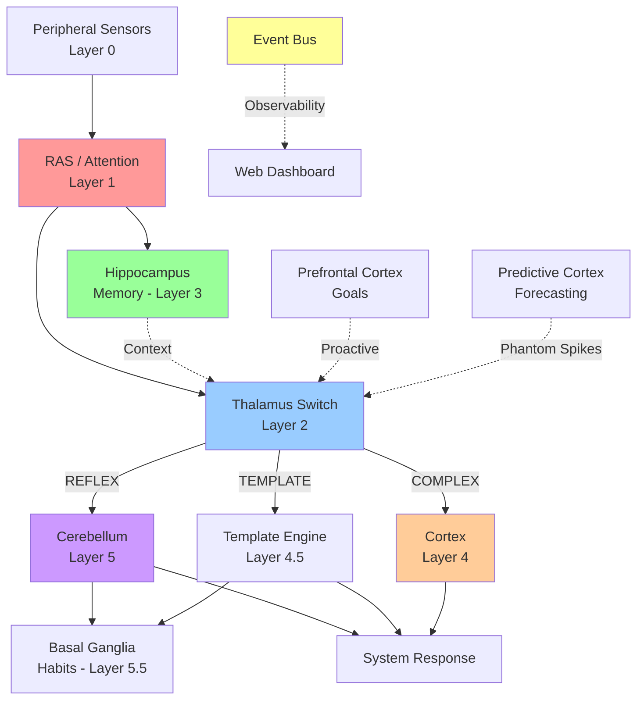

<!-- compressed from design.md by spec-compress — do not edit manually -->

## ReflexArc NSA Codebase Improvements Design

Arch: Event-driven neural cascade — bio-inspired layered processing (RAS→Thalamus→{Hippocampus,Cortex,Cerebellum}) with async event bus, maintains $0.50/day cost target

Stack: Node.js, PostgreSQL, Redis, EventEmitter2, Winston, Prometheus, OpenTelemetry

## Components:

| Component | Role | Depends on |
|-----------|------|-----------|
| RAS (Layer 1) | Attention filtering, peripheral input gating | Sensors |
| Thalamus (Layer 2) | Signal routing switch (REFLEX/TEMPLATE/COMPLEX paths) | RAS, Hippocampus context, PFC goals, Predictive spikes |
| Hippocampus (Layer 3) | Memory consolidation, contextual retrieval | RAS output |
| Cortex (Layer 4) | Complex pattern recognition, conscious processing | Thalamus COMPLEX path |
| Template Engine (Layer 4.5) | Rule-based response generation | Thalamus TEMPLATE path |
| Cerebellum (Layer 5) | Reflex execution, motor control | Thalamus REFLEX path |
| Basal Ganglia (Layer 5.5) | Habit consolidation, learned behaviors | Cerebellum, TemplateEngine |
| Event Bus | Async event dispatch, observability hook | All layers |
| Dashboard | Web UI visualization | EventBus |
| PFC (proactive) | Goal injection, strategic direction | Thalamus |
| Predictive Cortex | Forecasting, phantom spike generation | Thalamus |

## Seq:

## Data:

| Entity | Fields | Purpose |
|--------|--------|---------|
| SensoryEvent | id, timestamp, layer, sensorId, payload, priority | Raw sensor input |
| MemoryTrace | id, eventId, context, weight, ttl, createdAt | Hippocampus consolidation |
| RouteDecision | id, thalamusId, pathType (REFLEX\|TEMPLATE\|COMPLEX), targetLayer, latencyMs | Thalamus routing |
| HabitRecord | id, patternHash, frequency, lastFired, confidence | Basal Ganglia learning |
| SystemResponse | id, sourceLayer, actionType, payload, executedAt | Final output |

## Errors:

- DB sync fail → emit event + queue retry + log WARN
- RAS timeout → escalate to Thalamus with degraded confidence
- Memory consolidation fail → fall back to immediate recall, log ERROR
- Route decision fail → default to COMPLEX path, emit CIRCUIT_BREAK
- Template match fail → Cortex fallback or reject with explanation
- Cerebellum exec fail → log error + prevent habit consolidation
- EventBus full → drop lowest-priority events, alert ops
- Missing context → proceed with null context flag, log DEBUG
- PFC goal conflict → Thalamus arbitrates, logs decision
- Predictive spike noise → Thalamus applies dampening filter

## Tests:

**unit:** RAS.filter(), Thalamus.route(), Hippocampus.consolidate(), Template.match(), Cerebellum.execute(), Basal Ganglia.updateHabit(), EventBus.emit()

**int:** RAS→Thalamus→Cerebellum (reflex path), RAS→Thalamus→Template→BasalGanglia (template+habit), Thalamus→Cortex→Action (complex), Memory context injection into Thalamus routing, PFC goal override, Predictive spike dampening

**e2e:** Full sensor→action pipeline (happy path), degraded mode (missing layer), cost tracking (<$0.50/day), latency SLAs per path, dashboard event visualization, concurrent sensor load (100+ events/sec), recovery from DB outage, habit learning convergence
