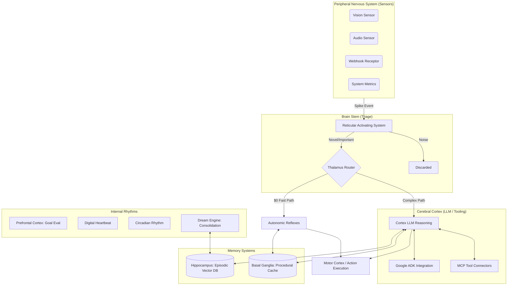

# ReflexArc Architecture Overview

ReflexArc is a **Neuro-Synthetic Architecture (NSA)** designed to mimic biological cognitive processes. Unlike traditional linear agents that follow a static loop (e.g., ReAct), ReflexArc is inherently asynchronous, event-driven, and layered. 

It processes sensory input in real-time, triaging events into distinct cognitive pathways (fast/cheap "reflexes" vs. slow/expensive "deep thought") to optimize both latency and token cost.

## High-Level System Diagram

The following diagram illustrates the lifecycle of a "spike" (event) as it travels through the ReflexArc nervous system.

---

## 🧠 Core Components Explained

### 1. Peripheral Nervous System (Sensors)
Sensors run in parallel background loops. They monitor external environments (filesystems, webhooks, audio, logs) and fire "Spikes" when a defined threshold is crossed. Spikes are standardized, lightweight JSON payloads that enter the system as sensory bursts.

### 2. Reticular Activating System (RAS) & Thalamus
Before hitting an expensive LLM, every spike hits the RAS.
*   **RAS**: Checks local caches (Basal Ganglia) to see if this exact stimulus was recently processed. If it's redundant noise, the spike is dropped.
*   **Thalamus**: If the spike passes the RAS, the Thalamus classifies its severity and complexity using a cheap, ultra-fast local heuristic (or small embedding similarity).
    *   **Simple/Known Problems**: Routed to **Reflexes** (Level 0 execution, $0 cost).
    *   **Complex/Unknown Problems**: Routed to the **Cortex** (Level 1+ execution, LLM cost).

### 3. The Cortex (LLM Reasoning & Tool Orchestration)
The Cortex is the seat of high-level reasoning, backed by a dynamic `ModelRouter` that can flip between providers (OpenAI, Anthropic, Gemini) depending on cost, availability, and capability.

When dealing with a complex spike, the Cortex loads relevant memories from the Hippocampus and dynamically pulls tools from:
*   **MCP Servers**: Standardized Model Context Protocol servers for things like filesystem access, SQL queries, or remote APIs.
*   **Google ADK**: Agent Development Kit tools and `SequentialAgent` swarms for complex, multi-step triage workflows.

### 4. Memory Systems
ReflexArc utilizes a dual-memory system to manage context limits and optimize repeated actions.
*   **Hippocampus (Long-Term)**: A vector database (`ChromaDB` / `FastEmbed`) that stores episodic memories—past spikes, the actions the Cortex took, and whether those actions were successful. When the Cortex encounters a new problem, it queries the Hippocampus for similar past experiences.
*   **Basal Ganglia (Procedural/Cache)**: A fast, in-memory cache with write-behind mechanics. It stores habitual responses to frequent stimuli. If the Thalamus spots a stimulus matching a Basal Ganglia entry, it bypasses the Cortex entirely and executes the cached reflex.

### 5. Internal Rhythms (Background Processes)
Biological brains don't just react; they maintain homeostasis.
*   **Prefrontal Cortex (PFC)**: Wakes up on a defined interval (e.g., every 5 minutes) to evaluate high-level system goals. If a goal is failing, it fires an internal "anxiety" spike, forcing the Cortex to prioritize fixing it.
*   **Digital Heartbeat**: Manages the pulse of the system, acting as a timing mechanism for internal loops.
*   **Predictive Cortex**: Runs in the background trying to anticipate the next state of system metrics. If the prediction is wildly off from reality, it generates a "surprise" spike.
*   **Dream Engine**: Runs during periods of low sensory input ("sleep"). It consolidates short-term logs, prunes redundant vectors from the Hippocampus, and attempts to synthesize new procedural rules for the Basal Ganglia based on the day's experiences.

---

## 🔄 The Autonomic Flow (Spike Lifecycle)

1.  **Stimulus**: `SystemVitalsSensor` detects CPU usage spiked to 99%.
2.  **Spike Created**: `{"source": "system_vitals", "type": "warning", "data": {"cpu": 99}}`
3.  **RAS Gate**: RAS checks if we've seen this in the last 60 seconds to avoid spamming the brain. If clear, proceeds.
4.  **Thalamus Route**: Thalamus analyzes the spike.
    *   *Path A (Reflex)*: If `BasalGanglia` has a stored reflex for "CPU>95%", it immediately runs `kill_zombie_processes.py` and logs the result.
    *   *Path B (Cortex)*: If this is the *first* time seeing this, it routes to the Cortex LLM. The Cortex searches the `Hippocampus` for previous high-CPU events. It decides to use an MCP Tool to scrape process lists, identifies a memory leak, executes a fix via the Google ADK Code Execution tool, and saves the successful result back to the `Hippocampus`.
5.  **Consolidation**: During the next `DreamEngine` cycle, if Path B was taken successfully and repeatedly, the Dream Engine will compress that complex Cortex reasoning into a simple rule and store it in the `BasalGanglia`, ensuring the next time CPU spikes, it takes the $0 Path A.
